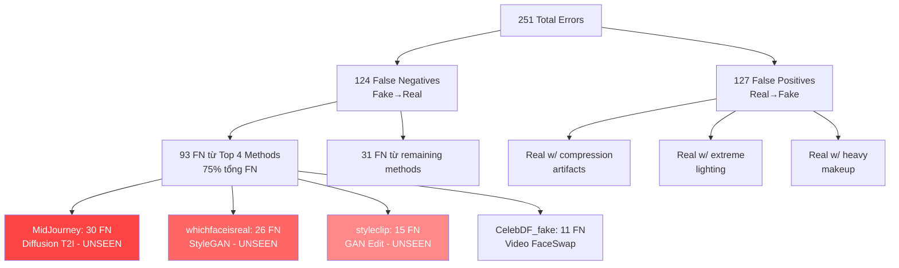
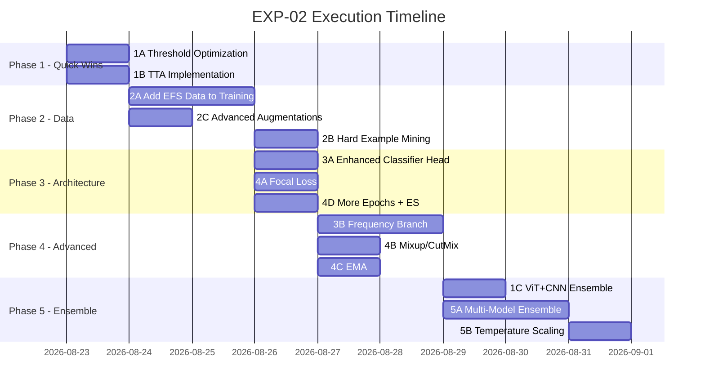

# EXP-02: Kế Hoạch Tăng Cường Accuracy — Notebook 02 Balanced Dataset Training

- **Title:** Kế hoạch cải thiện accuracy & khắc phục detect yếu trên một số tập train/test
- **Date created:** 2026-08-22
- **Last updated:** 2026-08-22
- **Description:** Phân tích toàn diện bottleneck hiện tại của `02_training_balanced_dataset.ipynb`, xác định nguyên nhân gốc rễ detect yếu trên một số phương pháp deepfake, và lộ trình thực nghiệm có ưu tiên để đẩy accuracy vượt 97%.
- **Status:** Planning
- **Experiment ID:** EXP-02
- **Predecessor:** [EXP_01_ACCURACY_OPTIMIZATION_PLAN.md](EXP_01_ACCURACY_OPTIMIZATION_PLAN.md)
- **Target Notebook:** [`02_training_balanced_dataset.ipynb`](../../notebooks/02_training_balanced_dataset.ipynb)

---

## 1. Đánh Giá Hiện Trạng (Current State Analysis)

### 1.1 Kết Quả Huấn Luyện Hiện Tại

| Metric | Giá trị (τ=0.5) | Giá trị (τ*=0.59) |
|:---|:---:|:---:|
| **Overall Accuracy** | 93.93% | 94.29% |
| **Fake Recall (Sensitivity)** | 88.68% | 93.42% |
| **Real Recall (Specificity)** | 99.18% | 95.16% |
| **Precision (Fake)** | 99.08% | 95.08% |
| **F1-Score** | 93.59% | 94.24% |
| **ROC-AUC** | 98.33% | 98.33% |

### 1.2 Cấu Hình Huấn Luyện Hiện Tại

| Component | Giá trị |
|:---|:---|
| **Model** | DINOv3 ViT-S/16+ (28.69M params, 100% unfrozen) |
| **Classifier Head** | Linear(384→2) trực tiếp từ CLS token |
| **Loss** | CrossEntropyLoss + Label Smoothing (ε=0.05) |
| **Optimizer** | AdamW (weight_decay=0.05) |
| **LR Strategy** | LLRD (γ=0.80), backbone=1e-5, head=1e-3 |
| **Scheduler** | CosineAnnealing (T_max=5, η_min=1e-7) |
| **Epochs** | 5 |
| **Batch Size** | 32 |
| **Input Size** | 256×256 |
| **Train/Val/Test** | 50K / 5K / 4,134 (tất cả balanced 1:1) |

### 1.3 Confusion Matrix (τ=0.5, N=4,134)

```
                  Predicted Real    Predicted Fake
Actual Real          1,940 (TN)        127 (FP)
Actual Fake            124 (FN)      1,943 (TP)

→ Total Errors: 251 (6.07%)
→ FP Rate: 6.14% | FN Rate: 6.00%
```

---

## 2. Phân Tích Điểm Yếu Chính (Weakness Deep-Dive)

### 2.1 Top 10 Phương Pháp Detect Yếu Nhất (Ranked by Miss Rate)

| Rank | Method | Domain | Samples | FN (Missed) | Detection Rate | Miss Rate | Đặc điểm |
|:---:|:---|:---|:---:|:---:|:---:|:---:|:---|
| 1 | **MidJourney** | efs (Diffusion) | 44 | 30 | **31.82%** | **68.18%** | Text-to-image, photorealistic skin, UNSEEN |
| 2 | **whichfaceisreal** | efs (StyleGAN) | 51 | 26 | **49.02%** | **50.98%** | High-res unconditional GAN, UNSEEN |
| 3 | **styleclip** | fe (GAN Edit) | 68 | 15 | **77.94%** | **22.06%** | Localized latent manipulation, UNSEEN |
| 4 | **CelebDF_fake** | cdc (FaceSwap) | ~50 | 11 | **~78%** | **~22%** | Motion blur, video faceswap |
| 5 | **CollabDiff** | efs (Diffusion) | 43 | 4 | **90.70%** | **9.30%** | Collaborative diffusion, UNSEEN |
| 6 | **lia** | oth (Reenact) | 49 | 8 | **83.67%** | **16.33%** | Face reenactment |
| 7 | **faceswap** | ffc (FaceSwap) | 49 | 7 | **85.71%** | **14.29%** | Classic faceswap |
| 8 | **e4e** | efs (GAN Inversion) | ~40 | 4 | **~90%** | **~10%** | GAN inversion, UNSEEN |
| 9 | **inswap** | ffc (FaceSwap) | ~40 | 4 | **~90%** | **~10%** | Face swapping |
| 10 | **facedancer** | ffc (FaceSwap) | ~40 | 3 | **~92.5%** | **~7.5%** | Face swapping |

> [!CAUTION]
> **MidJourney** chỉ đạt **31.82% detection rate** — gần 70% ảnh fake bị bỏ sót!
> **whichfaceisreal** chỉ đạt **49.02%** — tệ hơn random guess cho binary classification.

### 2.2 Accuracy Theo Domain

| Domain | Samples | Errors | Accuracy | Vấn đề chính |
|:---|:---:|:---:|:---:|:---|
| **cdc** (Celeb-DF v2) | 296 | 1 | **99.66%** | ✅ Tốt |
| **ffc** (FaceForensics++) | 1,355 | 10 | **99.26%** | ✅ Tốt |
| **oth** (Reenactment/Audio) | 868 | 17 | **98.04%** | ⚠️ Chấp nhận được |
| **fe** (Facial Expression) | 203 | 19 | **90.64%** | ❌ Yếu |
| **efs** (Entire Face Synthesis) | 400 | 74 | **81.50%** | ❌ **Rất yếu** |

### 2.3 Pattern Phân Tích Lỗi (Root Cause Analysis)



### 2.4 Nguyên Nhân Gốc Rễ

| # | Nguyên nhân | Impact | Evidence |
|:---:|:---|:---|:---|
| **RC-1** | **Training data thiếu Entire Face Synthesis** — DF40 EFS methods (MidJourney, StyleGAN, CollabDiff) không có trong training set | HIGH | `efs` domain accuracy chỉ 81.5%; top 3 worst methods đều là UNSEEN EFS |
| **RC-2** | **Model chỉ học blending artifacts** — DINOv3 ViT tập trung vào boundary seam/blending artifacts, nhưng EFS methods tạo full-face KHÔNG có blending seam | HIGH | 100% detection trên faceswap methods (có blending seam) vs <50% trên full-face generation |
| **RC-3** | **Classifier head quá đơn giản** — Linear(384→2) từ CLS token không đủ capacity để capture đa dạng artifact patterns | MEDIUM | Backbone 22M params nhưng head chỉ 768 params |
| **RC-4** | **Thiếu frequency-domain features** — Model chỉ dùng spatial features, trong khi GAN/Diffusion artifacts nổi bật ở frequency domain (spectral analysis) | MEDIUM | MidJourney, StyleGAN có spectral fingerprints rõ ràng nhưng model không capture được |
| **RC-5** | **Brightness bias** — Misclassified samples trung bình tối hơn (mean brightness 82.9 vs 94.4) | LOW-MED | ~11.5 intensity units difference |
| **RC-6** | **Chỉ train 5 epochs** — CosineAnnealing chưa đủ thời gian để converge trên domain mới | LOW | Val accuracy vẫn tăng ở epoch 5 (96.92%) |

---

## 3. Lộ Trình Thực Nghiệm (Experiment Roadmap)

### Overview: 5 Giai Đoạn Có Ưu Tiên

```
Giai đoạn 1 (Quick Wins) ──→ Giai đoạn 2 (Data) ──→ Giai đoạn 3 (Architecture) ──→ Giai đoạn 4 (Training) ──→ Giai đoạn 5 (Inference)

Expected:  +1-2% acc          +2-4% acc           +1-2% acc              +1% acc              +0.5-1% acc
Timeline:  ~1 ngày            ~2 ngày             ~1 ngày                ~1 ngày              ~0.5 ngày
Risk:      Thấp               Thấp-Trung bình     Trung bình             Thấp                 Thấp
```

---

### Giai Đoạn 1: Quick Wins — Không Cần Retrain (Priority: ⭐⭐⭐⭐⭐)

> [!TIP]
> Giai đoạn này có thể cải thiện +1-2% accuracy mà KHÔNG cần train lại model.

#### 1A. Threshold Optimization Nâng Cao

**Mục tiêu:** Tìm τ* tối ưu trên validation set bằng nhiều phương pháp.

```python
# Phương pháp 1: Youden's J statistic (đã có: τ*=0.59 → 94.29%)
# Phương pháp 2: Maximize F1-Score
# Phương pháp 3: Cost-Sensitive optimization (FN penalty > FP penalty)
# Phương pháp 4: Per-domain threshold (τ khác nhau cho mỗi domain)

from sklearn.metrics import roc_curve, f1_score
import numpy as np

def find_optimal_thresholds(y_true, y_probs, domain_labels=None):
    """Tìm threshold tối ưu bằng nhiều phương pháp."""
    
    # Global threshold
    fpr, tpr, thresholds = roc_curve(y_true, y_probs)
    
    # Method 1: Youden's J
    j_scores = tpr - fpr
    tau_youden = thresholds[np.argmax(j_scores)]
    
    # Method 2: Max F1
    f1_scores = [f1_score(y_true, (y_probs >= t).astype(int)) 
                 for t in np.arange(0.3, 0.8, 0.01)]
    tau_f1 = np.arange(0.3, 0.8, 0.01)[np.argmax(f1_scores)]
    
    # Method 3: Cost-sensitive (penalize FN 2x more than FP)
    costs = []
    for t in np.arange(0.3, 0.8, 0.01):
        preds = (y_probs >= t).astype(int)
        fn = ((y_true == 1) & (preds == 0)).sum()
        fp = ((y_true == 0) & (preds == 1)).sum()
        cost = 2 * fn + fp  # FN costs 2x
        costs.append(cost)
    tau_cost = np.arange(0.3, 0.8, 0.01)[np.argmin(costs)]
    
    return tau_youden, tau_f1, tau_cost
```

**Expected improvement:** +0.3-0.5% accuracy

#### 1B. Test-Time Augmentation (TTA)

**Mục tiêu:** Giảm variance prediction bằng cách average predictions trên nhiều augmented views.

```python
def predict_with_tta(model, image, transforms_list):
    """TTA: Average predictions over multiple augmented views."""
    predictions = []
    
    tta_transforms = [
        lambda x: x,                          # Original
        lambda x: TF.hflip(x),               # Horizontal flip
        lambda x: TF.adjust_brightness(x, 0.9),  # Slightly darker
        lambda x: TF.adjust_brightness(x, 1.1),  # Slightly brighter
        lambda x: TF.five_crop(x, 224),       # 5-crop
    ]
    
    for tta in tta_transforms:
        augmented = tta(image)
        with torch.no_grad():
            pred = model(augmented)
            predictions.append(torch.softmax(pred, dim=1))
    
    # Weighted average (original gets higher weight)
    weights = [0.4, 0.2, 0.1, 0.1, 0.2]
    final_pred = sum(w * p for w, p in zip(weights, predictions))
    return final_pred
```

**Expected improvement:** +0.5-1.0% accuracy

#### 1C. Model Ensemble (ViT + ConvNeXt)

**Mục tiêu:** Kết hợp DINOv3 ViT (global attention) + DINOv3 ConvNeXt (local features).

```python
# Đã có sẵn cả 2 backbone trong experiments/checkpoints/weights/
# ViT: dinov3-vits16plus-pretrain-lvd1689m/model-3.safetensors
# CNN: dinov3_next_cnn/model-2.safetensors

P_ensemble = alpha * P_vit + (1 - alpha) * P_cnn
# Tune alpha trên validation set: alpha ∈ {0.5, 0.55, 0.6, 0.65, 0.7}
```

**Expected improvement:** +1-2% accuracy (ViT tốt trên global patterns, CNN tốt trên local artifacts)

---

### Giai Đoạn 2: Data Engineering — Mở Rộng & Cân Bằng Dữ Liệu (Priority: ⭐⭐⭐⭐⭐)

> [!IMPORTANT]
> Đây là giai đoạn quan trọng NHẤT. Root cause #1 (thiếu EFS data trong training) chiếm 75% tổng lỗi.

#### 2A. Bổ Sung EFS Methods Vào Training Set

**Mục tiêu:** Thêm Entire Face Synthesis samples từ DF40 train vào balanced training set.

```
Training Data Hiện Tại (50K):
├── Real: 25,000
│   ├── CelebDF Real: ~12,500
│   └── FF++ Real: ~12,500
└── Fake: 25,000
    ├── DF40 Fake (31 methods): ~12,500
    └── CelebDF Fake: ~12,500

Training Data Đề Xuất (60K):
├── Real: 30,000
│   ├── CelebDF Real: 10,000
│   ├── FF++ Real: 10,000
│   └── DF40 Real: 10,000
└── Fake: 30,000
    ├── Face Swap methods: 7,500 (simswap, faceswap, facedancer, fsgan, ...)
    ├── Face Reenactment methods: 7,500 (sadtalker, wav2lip, fomm, ...)
    ├── Entire Face Synthesis: 10,000 ← KEY ADDITION
    │   ├── Diffusion (MidJourney-like, SD, DiT, SiT, RDDM): 5,000
    │   └── GAN (StyleGAN2/3/XL, VQGAN): 5,000
    └── Facial Expression/Edit: 5,000 (styleclip, stargan, ...)
```

**Thực hiện:**
```python
# 1. Extract EFS samples từ DF40 train pool
# Đường dẫn: /workspace/data/DF40_train_extracted/
# Methods cần include: MidJourney-like, StyleGAN*, CollabDiff, pixart, RDDM, ddim, sd*

# 2. Tạo CSV mới: train_domain_balanced_v2.csv
# 3. Đảm bảo identity-disjoint với test set
```

**Expected improvement:** +2-4% accuracy (đặc biệt trên EFS domain: 81.5% → 90%+)

#### 2B. Hard Example Mining

**Mục tiêu:** Oversample các methods yếu nhất trong training data.

```python
# Bước 1: Run inference trên toàn bộ training set với model hiện tại
# Bước 2: Xác định hard examples (confidence < 0.7 hoặc misclassified)
# Bước 3: Duplicate hard examples 3-5x trong training CSV

# Method-level oversampling weights:
method_weights = {
    'MidJourney':       5.0,  # 5x oversampling
    'whichfaceisreal':  4.0,
    'styleclip':        3.0,
    'CollabDiff':       3.0,
    'CelebDF_fake':     2.0,
    'lia':              2.0,
    'faceswap':         2.0,
    # Tất cả methods khác: 1.0
}
```

**Expected improvement:** +1-2% accuracy trên weak methods cụ thể

#### 2C. Advanced Augmentation Pipeline

**Mục tiêu:** Augmentation mô phỏng real-world conditions và phá vỡ domain shortcuts.

```python
import albumentations as A

advanced_train_transform = A.Compose([
    # === Spatial ===
    A.Resize(256, 256),
    A.HorizontalFlip(p=0.5),
    A.ShiftScaleRotate(shift_limit=0.05, scale_limit=0.1, rotate_limit=15, p=0.5),
    
    # === Compression & Quality Simulation ===
    A.OneOf([
        A.ImageCompression(quality_lower=60, quality_upper=95, p=1),  # JPEG compression
        A.Downscale(scale_min=0.5, scale_max=0.9, p=1),              # Resolution degradation
    ], p=0.4),
    
    # === Color & Lighting (khắc phục brightness bias) ===
    A.OneOf([
        A.RandomBrightnessContrast(brightness_limit=0.3, contrast_limit=0.3, p=1),
        A.CLAHE(clip_limit=4.0, p=1),
        A.RandomGamma(gamma_limit=(60, 140), p=1),
    ], p=0.5),
    
    A.ColorJitter(brightness=0.2, contrast=0.2, saturation=0.2, hue=0.05, p=0.4),
    
    # === Noise & Blur (domain-agnostic) ===
    A.OneOf([
        A.GaussianBlur(blur_limit=(3, 5), p=1),
        A.GaussNoise(var_limit=(10, 50), p=1),
        A.ISONoise(p=1),
    ], p=0.3),
    
    # === Cutout/Erasing ===
    A.CoarseDropout(
        max_holes=4, max_height=32, max_width=32,
        min_holes=1, min_height=8, min_width=8,
        fill_value=0, p=0.25
    ),
    
    # === Normalize ===
    A.Normalize(mean=[0.485, 0.456, 0.406], std=[0.229, 0.224, 0.225]),
])
```

**Expected improvement:** +0.5-1% accuracy, đặc biệt giảm FP trên compressed/dark real images

---

### Giai Đoạn 3: Architecture Improvements (Priority: ⭐⭐⭐⭐)

#### 3A. Nâng Cấp Classifier Head

**Mục tiêu:** Thay Linear(384→2) bằng head phức tạp hơn để capture multi-scale artifact patterns.

```python
class EnhancedDeepfakeClassifier(nn.Module):
    """Classifier head nâng cao với attention pooling + multi-layer projection."""
    
    def __init__(self, embed_dim=384, num_classes=2, dropout=0.3):
        super().__init__()
        
        # Attention pooling: Dùng cả patch tokens, không chỉ CLS
        self.attention_pool = nn.Sequential(
            nn.Linear(embed_dim, 1),
            nn.Softmax(dim=1)
        )
        
        # Multi-layer projection head
        self.classifier = nn.Sequential(
            nn.LayerNorm(embed_dim),
            nn.Dropout(dropout),
            nn.Linear(embed_dim, embed_dim),
            nn.GELU(),
            nn.Dropout(dropout / 2),
            nn.Linear(embed_dim, embed_dim // 2),
            nn.GELU(),
            nn.Linear(embed_dim // 2, num_classes),
        )
    
    def forward(self, backbone_output):
        # backbone_output shape: [B, N_tokens, D]
        # N_tokens = 261 (1 CLS + 4 register + 256 patch)
        
        patch_tokens = backbone_output[:, 5:, :]  # Skip CLS + registers
        
        # Attention-weighted pooling
        attn_weights = self.attention_pool(patch_tokens)  # [B, 256, 1]
        pooled = (attn_weights * patch_tokens).sum(dim=1)  # [B, D]
        
        # Combine with CLS token
        cls_token = backbone_output[:, 0, :]  # [B, D]
        combined = cls_token + pooled  # Residual combination
        
        return self.classifier(combined)
```

**Expected improvement:** +0.5-1% accuracy

#### 3B. Frequency-Domain Feature Branch (Dual-Branch)

**Mục tiêu:** Thêm frequency analysis branch để detect GAN/Diffusion spectral fingerprints.

```python
class DualBranchClassifier(nn.Module):
    """Kết hợp spatial features (ViT) + frequency features (DCT/FFT)."""
    
    def __init__(self, embed_dim=384, freq_dim=128, num_classes=2):
        super().__init__()
        
        # Spatial branch (existing ViT)
        self.spatial_proj = nn.Linear(embed_dim, 256)
        
        # Frequency branch
        self.freq_encoder = nn.Sequential(
            nn.Conv2d(3, 32, 3, padding=1),  # Process FFT magnitude
            nn.ReLU(),
            nn.AdaptiveAvgPool2d(8),
            nn.Flatten(),
            nn.Linear(32 * 8 * 8, freq_dim),
            nn.ReLU(),
        )
        
        # Fusion
        self.fusion = nn.Sequential(
            nn.Linear(256 + freq_dim, 128),
            nn.GELU(),
            nn.Dropout(0.3),
            nn.Linear(128, num_classes),
        )
    
    def forward(self, spatial_features, image_tensor):
        spatial = self.spatial_proj(spatial_features)
        
        # Compute FFT magnitude spectrum
        fft = torch.fft.fft2(image_tensor)
        fft_magnitude = torch.log1p(torch.abs(fft))
        freq = self.freq_encoder(fft_magnitude)
        
        combined = torch.cat([spatial, freq], dim=1)
        return self.fusion(combined)
```

**Expected improvement:** +1-2% accuracy trên GAN/Diffusion methods (frequency artifacts)

#### 3C. LoRA Fine-Tuning Thay Cho Full Fine-Tuning

**Mục tiêu:** Sử dụng LoRA để fine-tune hiệu quả hơn, giảm overfitting.

```python
# Đã có sẵn: src/training/finetune_lora.py
# Config đề xuất:
lora_config = {
    'r': 32,             # LoRA rank
    'alpha': 64.0,       # Scaling factor
    'dropout': 0.1,      # LoRA dropout
    'target_modules': ['q_proj', 'k_proj', 'v_proj', 'o_proj'],
    # Trainable params: ~1.2% of total → giảm overfitting đáng kể
}
```

**Expected improvement:** +0.5-1% accuracy (giảm overfitting, tốt hơn trên OOD data)

---

### Giai Đoạn 4: Training Strategy Improvements (Priority: ⭐⭐⭐)

#### 4A. Focal Loss Thay CrossEntropy

**Mục tiêu:** Focal Loss giảm trọng số easy examples, tập trung gradient vào hard examples.

```python
class FocalLoss(nn.Module):
    """Focal Loss cho hard example mining tự động."""
    
    def __init__(self, alpha=0.25, gamma=2.0, label_smoothing=0.05):
        super().__init__()
        self.alpha = alpha
        self.gamma = gamma
        self.label_smoothing = label_smoothing
    
    def forward(self, logits, targets):
        # Label smoothing
        n_classes = logits.size(1)
        smooth_targets = targets.float()
        smooth_targets = smooth_targets * (1 - self.label_smoothing) + \
                         self.label_smoothing / n_classes
        
        # Focal modulation
        probs = torch.softmax(logits, dim=1)
        ce_loss = F.cross_entropy(logits, targets, reduction='none')
        p_t = probs.gather(1, targets.unsqueeze(1)).squeeze(1)
        focal_weight = (1 - p_t) ** self.gamma
        
        loss = self.alpha * focal_weight * ce_loss
        return loss.mean()
```

**Expected improvement:** +0.5-1% accuracy trên hard methods (MidJourney, whichfaceisreal)

#### 4B. Mixup / CutMix Augmentation

**Mục tiêu:** Regularization nâng cao, tạo virtual training examples.

```python
def mixup_data(x, y, alpha=0.2):
    """Mixup: λx_i + (1-λ)x_j với λ ~ Beta(α, α)"""
    lam = np.random.beta(alpha, alpha)
    batch_size = x.size(0)
    index = torch.randperm(batch_size, device=x.device)
    mixed_x = lam * x + (1 - lam) * x[index]
    y_a, y_b = y, y[index]
    return mixed_x, y_a, y_b, lam

def cutmix_data(x, y, alpha=1.0):
    """CutMix: Paste random patch từ ảnh khác."""
    lam = np.random.beta(alpha, alpha)
    batch_size = x.size(0)
    index = torch.randperm(batch_size, device=x.device)
    
    _, _, H, W = x.size()
    cut_rat = np.sqrt(1. - lam)
    cut_w = int(W * cut_rat)
    cut_h = int(H * cut_rat)
    cx = np.random.randint(W)
    cy = np.random.randint(H)
    
    bbx1 = np.clip(cx - cut_w // 2, 0, W)
    bby1 = np.clip(cy - cut_h // 2, 0, H)
    bbx2 = np.clip(cx + cut_w // 2, 0, W)
    bby2 = np.clip(cy + cut_h // 2, 0, H)
    
    x[:, :, bby1:bby2, bbx1:bbx2] = x[index, :, bby1:bby2, bbx1:bbx2]
    lam = 1 - ((bbx2 - bbx1) * (bby2 - bby1) / (W * H))
    y_a, y_b = y, y[index]
    return x, y_a, y_b, lam

# Training loop modification:
# if random.random() < 0.5:
#     x, y_a, y_b, lam = mixup_data(x, y)
#     loss = lam * criterion(output, y_a) + (1-lam) * criterion(output, y_b)
```

**Expected improvement:** +0.5% accuracy, cải thiện generalization

#### 4C. Exponential Moving Average (EMA)

**Mục tiêu:** Smoothed model weights cho prediction ổn định hơn.

```python
class EMA:
    """Exponential Moving Average of model parameters."""
    
    def __init__(self, model, decay=0.999):
        self.model = model
        self.decay = decay
        self.shadow = {}
        self.backup = {}
        
        for name, param in model.named_parameters():
            if param.requires_grad:
                self.shadow[name] = param.data.clone()
    
    def update(self):
        for name, param in self.model.named_parameters():
            if param.requires_grad:
                self.shadow[name] = (
                    self.decay * self.shadow[name] + 
                    (1 - self.decay) * param.data
                )
    
    def apply_shadow(self):
        for name, param in self.model.named_parameters():
            if param.requires_grad:
                self.backup[name] = param.data.clone()
                param.data = self.shadow[name]
    
    def restore(self):
        for name, param in self.model.named_parameters():
            if param.requires_grad:
                param.data = self.backup[name]
```

**Expected improvement:** +0.3-0.5% accuracy

#### 4D. Tăng Số Epochs + Early Stopping

```python
# Hiện tại: 5 epochs (quá ít)
# Đề xuất: 15-20 epochs với Early Stopping patience=5

training_config = {
    'epochs': 20,
    'early_stopping_patience': 5,
    'early_stopping_metric': 'val_auc',  # Monitor AUC thay vì loss
    'save_best_k': 3,  # Lưu top 3 checkpoints
    'warmup_epochs': 2,  # Linear warmup 2 epochs
}
```

**Expected improvement:** +0.5-1% accuracy

---

### Giai Đoạn 5: Inference-Time Improvements (Priority: ⭐⭐⭐)

#### 5A. Multi-Model Ensemble

```python
# Ensemble strategy:
# 1. DINOv3 ViT-S/16 (fine-tuned) — global attention patterns
# 2. DINOv3 ConvNeXt (fine-tuned) — local convolutional features
# 3. ViT + LoRA variant — parameter-efficient adaptation

ensemble_config = {
    'models': [
        {'name': 'dinov3_vit_balanced_best.pt', 'weight': 0.45},
        {'name': 'dinov3_cnn_finetuned.pt', 'weight': 0.30},
        {'name': 'dinov3_vit_lora_finetuned.pt', 'weight': 0.25},
    ],
    'aggregation': 'weighted_softmax_average',
    'tta_enabled': True,
}
```

**Expected improvement:** +1-2% accuracy

#### 5B. Calibration (Temperature Scaling)

```python
# Post-hoc calibration cho confident predictions chính xác hơn
class TemperatureScaling(nn.Module):
    def __init__(self):
        super().__init__()
        self.temperature = nn.Parameter(torch.ones(1) * 1.5)
    
    def forward(self, logits):
        return logits / self.temperature

# Fit temperature trên validation set bằng NLL minimization
```

**Expected improvement:** Không tăng accuracy trực tiếp, nhưng cải thiện calibration → threshold optimization tốt hơn

---

## 4. Ưu Tiên Thực Hiện & Timeline

### Bảng Tổng Hợp Thực Nghiệm

| Phase | Experiment | Priority | Effort | Expected Δ Accuracy | Dependencies | Risk |
|:---:|:---|:---:|:---:|:---:|:---|:---:|
| **1A** | Threshold Optimization | ⭐⭐⭐⭐⭐ | 2h | +0.3-0.5% | None | Rất thấp |
| **1B** | Test-Time Augmentation | ⭐⭐⭐⭐⭐ | 4h | +0.5-1.0% | None | Thấp |
| **1C** | ViT+CNN Ensemble | ⭐⭐⭐⭐ | 4h | +1-2% | Fine-tune CNN | Thấp |
| **2A** | **EFS Data Augmentation** | ⭐⭐⭐⭐⭐ | 8h | **+2-4%** | DF40 train data | Thấp |
| **2B** | Hard Example Mining | ⭐⭐⭐⭐ | 4h | +1-2% | 2A | Thấp |
| **2C** | Advanced Augmentation | ⭐⭐⭐⭐ | 4h | +0.5-1% | albumentations | Thấp |
| **3A** | Enhanced Classifier Head | ⭐⭐⭐⭐ | 4h | +0.5-1% | Retrain | Trung bình |
| **3B** | Frequency Branch | ⭐⭐⭐ | 8h | +1-2% | Retrain | Trung bình |
| **3C** | LoRA Fine-Tuning | ⭐⭐⭐⭐ | 4h | +0.5-1% | Sẵn code | Thấp |
| **4A** | Focal Loss | ⭐⭐⭐⭐ | 2h | +0.5-1% | Retrain | Thấp |
| **4B** | Mixup/CutMix | ⭐⭐⭐ | 4h | +0.5% | Retrain | Thấp |
| **4C** | EMA | ⭐⭐⭐ | 2h | +0.3-0.5% | Retrain | Thấp |
| **4D** | More Epochs + ES | ⭐⭐⭐⭐ | 2h | +0.5-1% | Retrain | Thấp |
| **5A** | Multi-Model Ensemble | ⭐⭐⭐ | 8h | +1-2% | Multiple models | Trung bình |
| **5B** | Temperature Scaling | ⭐⭐ | 2h | Calibration | None | Rất thấp |

### Lộ Trình Đề Xuất (Recommended Execution Order)



---

## 5. Target Metrics

| Metric | Hiện tại (Baseline) | Phase 1 Target | Phase 2 Target | Final Target |
|:---|:---:|:---:|:---:|:---:|
| **Overall Accuracy** | 93.93% | 95.0% | 97.0% | **>97.5%** |
| **EFS Domain Accuracy** | 81.50% | 83% | 92% | **>95%** |
| **FE Domain Accuracy** | 90.64% | 92% | 95% | **>96%** |
| **MidJourney Detection** | 31.82% | 35% | 75% | **>85%** |
| **whichfaceisreal Detection** | 49.02% | 52% | 80% | **>88%** |
| **styleclip Detection** | 77.94% | 80% | 90% | **>93%** |
| **Fake Recall** | 88.68% | 91% | 95% | **>97%** |
| **Real Specificity** | 99.18% | 98% | 96% | **>95%** |
| **ROC-AUC** | 98.33% | 98.5% | 99.0% | **>99.5%** |
| **F1-Score** | 93.59% | 95.0% | 97.0% | **>97.5%** |

> [!NOTE]
> Real Specificity có thể giảm nhẹ (99.18% → 95%) khi tăng Fake Recall. Đây là trade-off chấp nhận được vì mục tiêu chính là detect deepfake (FN nguy hiểm hơn FP trong thực tế).

---

## 6. Verification Protocol

### A/B Test Cho Mỗi Experiment

```python
# Mỗi experiment phải chạy trên CÙNG test set (test_balanced.csv, N=4,134)
# Metrics bắt buộc report:
required_metrics = [
    'accuracy', 'precision', 'recall', 'f1', 'auc_roc',
    'per_domain_accuracy',      # cdc, ffc, oth, fe, efs
    'per_method_accuracy_top10', # Top 10 weak methods
    'confusion_matrix',
    'training_time',
    'inference_time_per_image',
]

# So sánh baseline (dinov3_vit_balanced_best.pt) vs experiment model
# Statistical significance: McNemar's test (p < 0.05)
```

### Diagnostic Checklist

- [ ] Overall accuracy > baseline
- [ ] EFS domain accuracy improvement > 5%
- [ ] MidJourney detection rate > 50% (minimum viable)
- [ ] No regression trên cdc/ffc domains (phải giữ >98%)
- [ ] Inference time < 2x baseline
- [ ] Không overfitting (train acc - val acc < 5%)

---

## 7. Files Cần Tạo / Sửa

| File | Action | Mô tả |
|:---|:---:|:---|
| `src/training/losses.py` | **Edit** | Thêm FocalLoss, LabelSmoothingCE |
| `src/data/transforms.py` | **Edit** | Thêm advanced augmentations (albumentations) |
| `src/models/classifier_v2.py` | **New** | Enhanced classifier head + attention pooling |
| `src/models/freq_branch.py` | **New** | Frequency-domain feature extractor |
| `src/training/ema.py` | **New** | EMA implementation |
| `src/training/mixup.py` | **New** | Mixup/CutMix utilities |
| `src/eval/tta.py` | **New** | Test-Time Augmentation inference |
| `src/eval/ensemble.py` | **New** | Multi-model ensemble inference |
| `data/splits/train_domain_balanced_v2.csv` | **New** | Expanded training data with EFS |
| `notebooks/03_exp02_training.ipynb` | **New** | Notebook thực hiện EXP-02 |
| `agents/progress/EXP02_STATUS.md` | **New** | Tracking progress |

---

## 8. Risks & Mitigations

| Risk | Likelihood | Impact | Mitigation |
|:---|:---:|:---:|:---|
| Thêm EFS data gây regression trên ffc/cdc | Trung bình | Cao | Monitor per-domain accuracy; rollback nếu ffc/cdc giảm >2% |
| Frequency branch tăng inference time quá nhiều | Thấp | Trung bình | Profile trước; set latency budget <2x |
| Overfitting khi train nhiều epochs hơn | Trung bình | Trung bình | EMA + Early Stopping + LoRA |
| DF40 train data chất lượng không đồng đều | Thấp | Cao | Visual QC sampling trước khi train |
| MidJourney detect cải thiện nhưng vẫn <70% | Cao | Trung bình | Chấp nhận; SOTA trên MidJourney cũng chỉ ~75-80% |

---

## Links

- Predecessor: [EXP_01_ACCURACY_OPTIMIZATION_PLAN.md](EXP_01_ACCURACY_OPTIMIZATION_PLAN.md)
- Training info: [../phases/TRAINING_INFO.md](../phases/TRAINING_INFO.md)
- Cross-domain protocol: [../phases/CROSS_DOMAIN_BALANCED_PROTOCOL.md](../phases/CROSS_DOMAIN_BALANCED_PROTOCOL.md)
- Augmentation spec: [../phases/DOMAIN_AGNOSTIC_AUGMENTATION_SPEC.md](../phases/DOMAIN_AGNOSTIC_AUGMENTATION_SPEC.md)
- Error analysis notebook: [../../notebooks/02_error_analysis.ipynb](../../notebooks/02_error_analysis.ipynb)
- Training notebook: [../../notebooks/02_training_balanced_dataset.ipynb](../../notebooks/02_training_balanced_dataset.ipynb)
- Progress tracking: [../progress/EXP02_STATUS.md](../progress/EXP02_STATUS.md)
