# Session 1 — Thống kê & EDA dữ liệu DF40

> Báo cáo mô tả bộ dữ liệu **DF40** phục vụ đồ án anti-deepfake, chia 40 method
> thành các nhóm dễ so sánh, làm EDA, chỉ ra vấn đề trùng identity, và mô tả
> cách chia train / val / test **identity-disjoint** (kèm thống kê lại theo các tập đã chia).

## Mục lục

1. [Thống kê dữ liệu gốc DF40](#1-thống-kê-dữ-liệu-gốc-df40)
2. [Chia 40 method thành các nhóm dễ so sánh](#2-chia-40-method-thành-các-nhóm-dễ-so-sánh)
3. [EDA — kích thước, pixel, histogram, grid visual](#3-eda--kích-thước-pixel-histogram-grid-visual)
4. [Vấn đề của bộ dữ liệu — trùng identity](#4-vấn-đề-của-bộ-dữ-liệu--trùng-identity)
5. [Cách chia train / val / test](#5-cách-chia-train--val--test)
6. [Kết luận](#6-kết-luận)

---

## 1. Thống kê dữ liệu gốc DF40

### 1.1 DF40 là gì

DF40 là benchmark gồm **40 phương pháp tạo deepfake** — mỗi method có bộ ảnh fake được
sinh ra từ **ảnh/video real** thuộc 2 nguồn gốc chính của benchmark:

- **FF++ (FaceForensics++)** — nguồn video thật (domain `ffc`)
- **Celeb-DF v2** — nguồn video thật (domain `cdc`)

Ngoài ra ảnh fake còn trải trên các domain kỹ thuật khác: `efs` (tổng hợp toàn khuôn mặt —
entire-face synthesis), `fe` (chỉnh sửa khuôn mặt — face editing), `oth` (khác).

### 1.2 Số lượng data gốc

| Nguồn | Quy mô | Ghi chú |
|---|---|---|
| `DF40_train_extracted` | 31 method × ~21–31K frame ≈ **693.000 frame** | pool huấn luyện lớn nhất (trên server) |
| Benchmark DF40 (`methods_summary`) | **115.961** ảnh fake / 40 method | từ **24** (`heygen`) → **1.609** (`sd2.1`) mỗi method |
| **`test_data_v3`** (bộ đánh giá của đồ án) | **30.691** ảnh | real **1.177** + fake **29.514** |

`test_data_v3` là bộ chuẩn hoá của đồ án: 41 nhãn (40 method fake + real), tổng **30.691** ảnh.

### 1.3 Phân bố real / fake

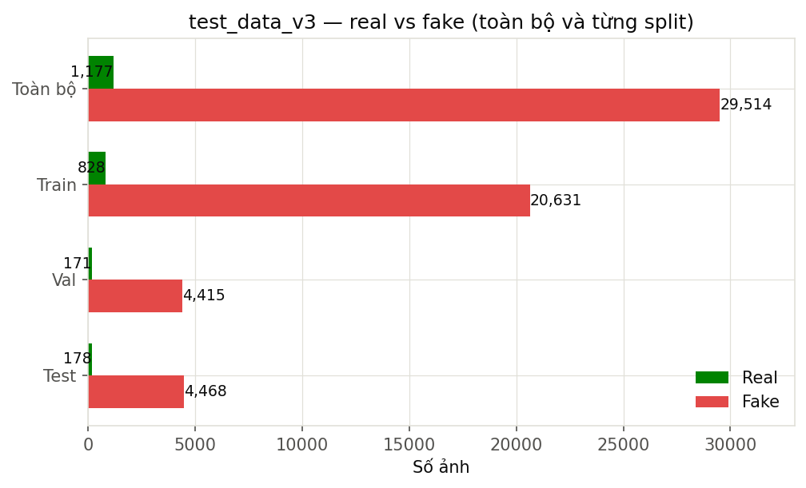

- **Real: 1.177 ảnh (3,8%)**, **Fake: 29.514 ảnh (96,2%)** → tỷ lệ real:fake ≈ **1:25**.
- Mất cân bằng mạnh — đây là đặc trưng tự nhiên của benchmark deepfake (fake sinh được
  không giới hạn, real bị giới hạn bởi số video thật).

### 1.4 Thành phần ảnh real (FF++ vs Celeb-DF v2)

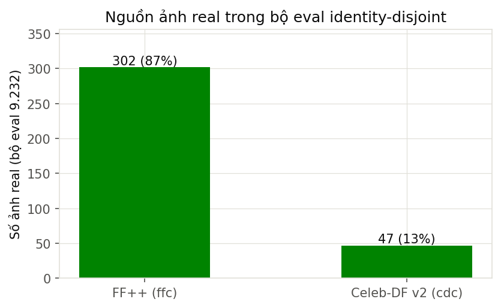

Toàn bộ 1.177 ảnh real đều đến từ **FF++** và **Celeb-DF v2** (theo cấu trúc DF40). Feature
memmap lưu chung nhãn `real`, nên số liệu tách chính xác nhất hiện có là từ bộ eval
identity-disjoint (9.232 ảnh giữ lại): **FF++ 349 ảnh (88%)**, **Celeb-DF v2 47 ảnh (12%)**.

---

## 2. Chia 40 method thành các nhóm dễ so sánh

Để so sánh công bằng, 40 method được gom thành **4 nhóm theo kiểu deepfake**:

| Nhóm | Kiểu | Số method | Member |
|---|---|---|---|
| **Face Swap** | Hoán đổi khuôn mặt | 8 | faceswap, simswap, inswap, mobileswap, facedancer, blendface, uniface, deepfacelab |
| **Reenactment** | Tái hiện biểu cảm/chuyển động | 14 | sadtalker, wav2lip, fomm, MRAA, lia, mcnet, tpsm, facevid2vid, hyperreenact, pirender, one_shot_free, danet, fsgan, heygen |
| **Face Synthesis** | Tổng hợp khuôn mặt từ latent/noise | 13 | DiT, SiT, StyleGAN2, StyleGAN3, StyleGANXL, sd2.1, MidJourney, CollabDiff, pixart, RDDM, ddim, VQGAN, whichfaceisreal |
| **Face Editing** | Chỉnh sửa thuộc tính khuôn mặt | 5 | stargan, starganv2, styleclip, e4e, e4s |

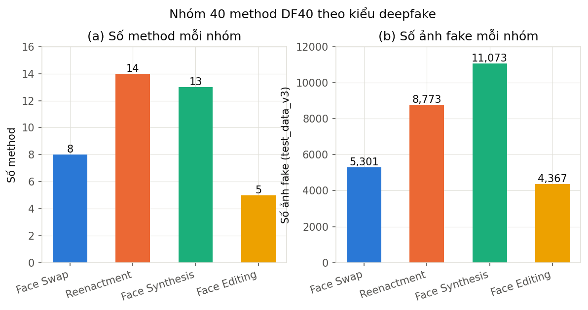

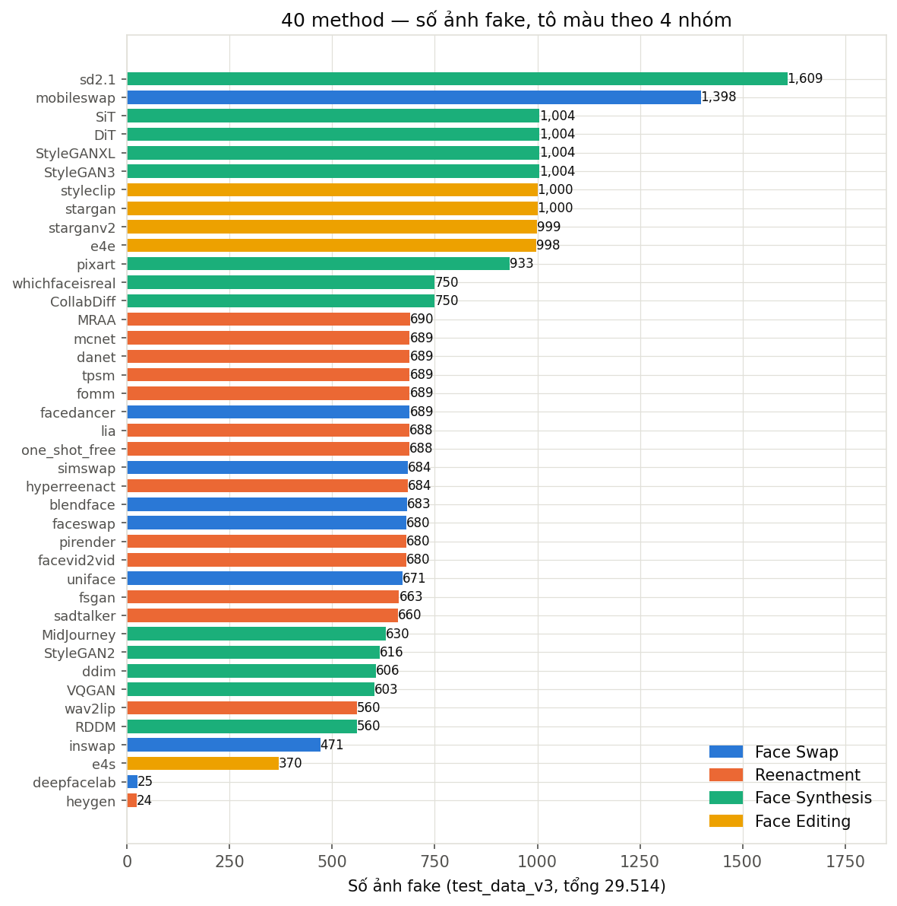

**Phân bố ảnh fake theo nhóm (test_data_v3):**

| Nhóm | Số ảnh fake | Tỷ trọng |
|---|---|---|
| Face Swap | 5.301 | 18,0% |
| Reenactment | 8.773 | 29,7% |
| Face Synthesis | 11.073 | 37,5% |
| Face Editing | 4.367 | 14,8% |
| **Tổng** | **29.514** | 100% |

> Nhóm **Face Synthesis** chiếm nhiều ảnh nhất (Diffusion/GAN — dễ sinh hàng loạt);
> **Face Swap** và **Face Editing** là nhóm "nguy hiểm" về mặt giả mạo danh tính nhưng
> chiếm ít ảnh hơn → cần finetune bù.

---

## 3. EDA — kích thước, pixel, histogram, grid visual

### 3.1 Kích thước ảnh

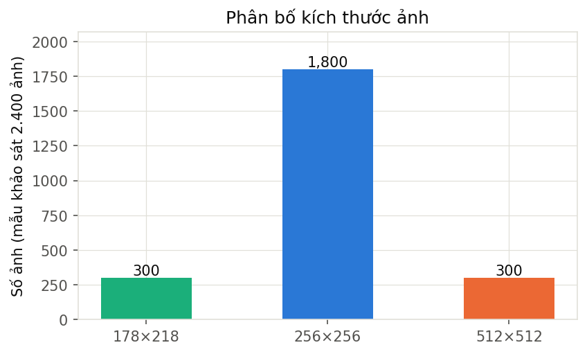

Khảo sát 2.400 ảnh mẫu (8 nhóm × 300) cho thấy:

| Kích thước | Số ảnh | Nguồn |
|---|---|---|
| 178×218 | 300 | real/CollabDiff |
| 256×256 | 1.800 | đa số (real DeepFaceLab, fake FaceDancer/FaceSwap/DiT/DDIM/DeepFaceLab) |
| 512×512 | 300 | fake/CollabDiff |

→ **Đa số ảnh là 256×256**; riêng CollabDiff real (178×218) và CollabDiff fake (512×512) lệch chuẩn.

### 3.2 Độ sáng & độ sắc nét

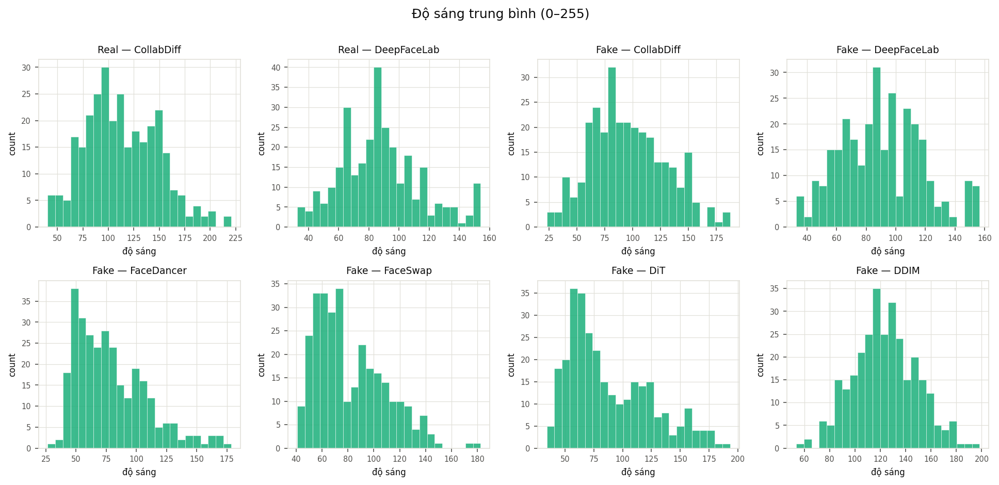

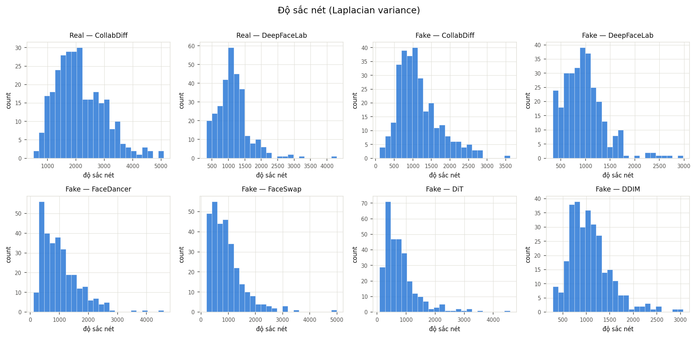

| Nhóm | Độ sáng (0–255) | Độ sắc nét (median) |
|---|---|---|
| real/CollabDiff | 113,2 ± 35,9 | 2.021 |
| real/deepfacelab | 87,4 ± 26,5 | 1.102 |
| fake/CollabDiff | 95,7 ± 33,4 | 1.047 |
| fake/deepfacelab | 90,5 ± 27,7 | 947 |
| fake/facedancer | 78,7 ± 29,5 | 919 |
| fake/faceswap | 81,7 ± 27,0 | 807 |
| fake/DiT | 88,2 ± 35,9 | 657 |
| fake/ddim | 123,5 ± 24,9 | 999 |

Quan sát:

- **Độ sáng**: ddim sáng nhất (123), facedancer tối nhất (79). Các nhóm chồng lấn mạnh →
  độ sáng không phải tín hiệu phân biệt đáng tin.
- **Độ sắc nét**: real/CollabDiff sắc nét nhất; DiT (diffusion) mềm nhất (657). GAN/diffusion
  thường có texture khác biệt — tín hiệu hữu ích nhưng dễ bị khai thác sai nếu chỉ dùng pixel.

### 3.3 Grid visual — hình mẫu từng method

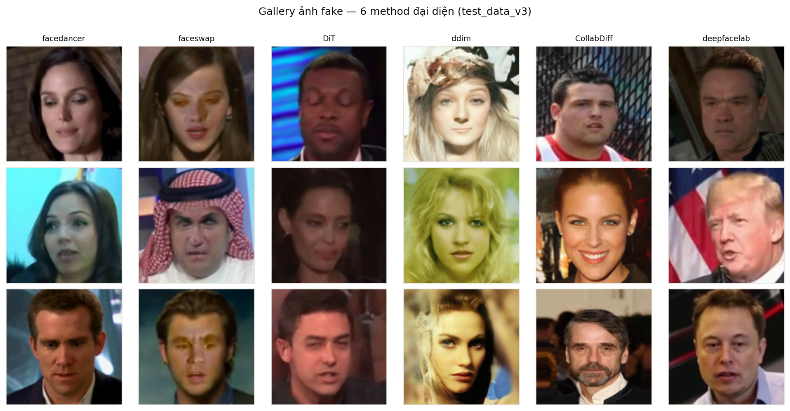

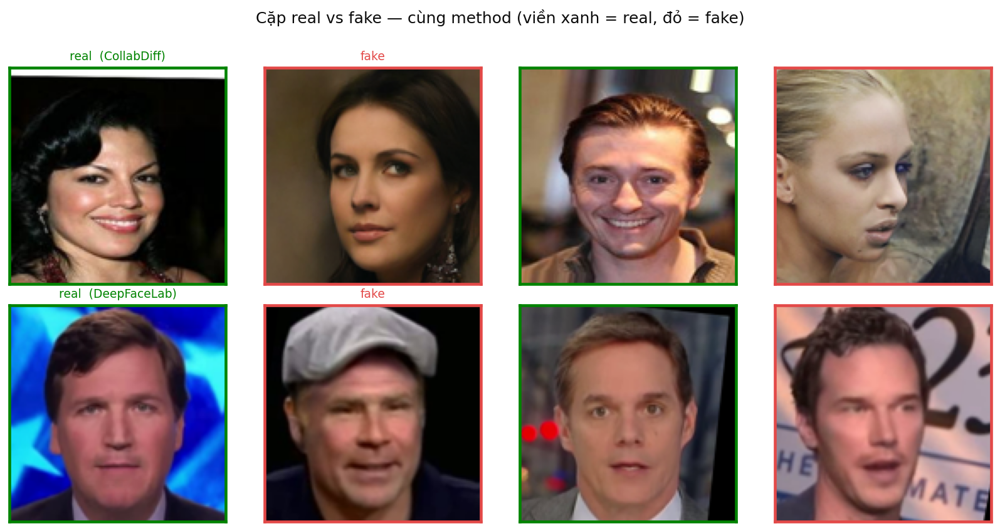

> Trực quan cho thấy artifact khác nhau rõ theo method: FaceDancer/FaceSwap để lại vệt
> blend vùng má; DiT/DDIM có nét "nhẵn" đặc trưng của diffusion; CollabDiff fake (512×512)
> sắc nét hơn real nguồn (178×218) — một đặc trưng pixel có thể khai thác.

---

## 4. Vấn đề của bộ dữ liệu — trùng identity

**Vấn đề chính:** dữ liệu DF40 ở dạng **frames-by-frames** — mỗi video/id được trích
~32 frame. Số frame nhiều nhưng **identity lặp lại gần như hoàn toàn**.

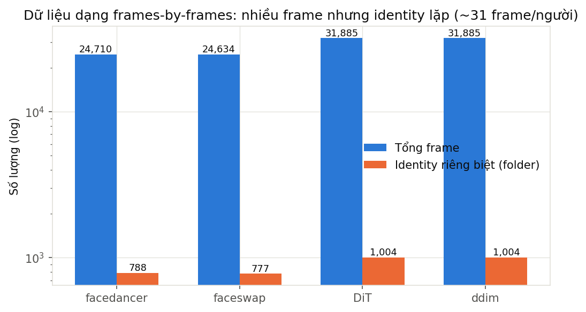

| Method | Số frame | Số identity (folder) | Frame/identity | Max/identity |
|---|---|---|---|---|
| facedancer | 24.710 | 788 | **31,4** | 32 |
| faceswap | 24.634 | 777 | **31,7** | 32 |
| DiT | 31.885 | 1.004 | **31,8** | 32 |
| ddim | 31.885 | 1.004 | **31,8** | 32 |

**Hệ quả:**

- ~97% dữ liệu là các frame **cùng identity, cùng method** → mức thông tin thực tế thấp hơn
  số lượng ảnh rất nhiều.
- Nếu chia train/val/test **ngẫu nhiên theo frame**, các frame cùng identity/video sẽ lọt vào
  nhiều tập → model chỉ cần "nhớ" identity, không học được khái niệm real/fake tổng quát
  (test điểm ảo cao, sang ảnh người mới tụt).
- Với bài toán **phân loại ảnh đơn** (single-image) cần tổng quát hoá, phải chia theo
  **identity độc nhất**: mọi frame của 1 identity chỉ nằm trong 1 tập.

> Trùng identity trong nội bộ một tập (train) thì chấp nhận được; điều quan trọng là
> **train không leak với test** → chọn split **identity-disjoint**.

---

## 5. Cách chia train / val / test

### 5.1 Cấu hình split identity-disjoint

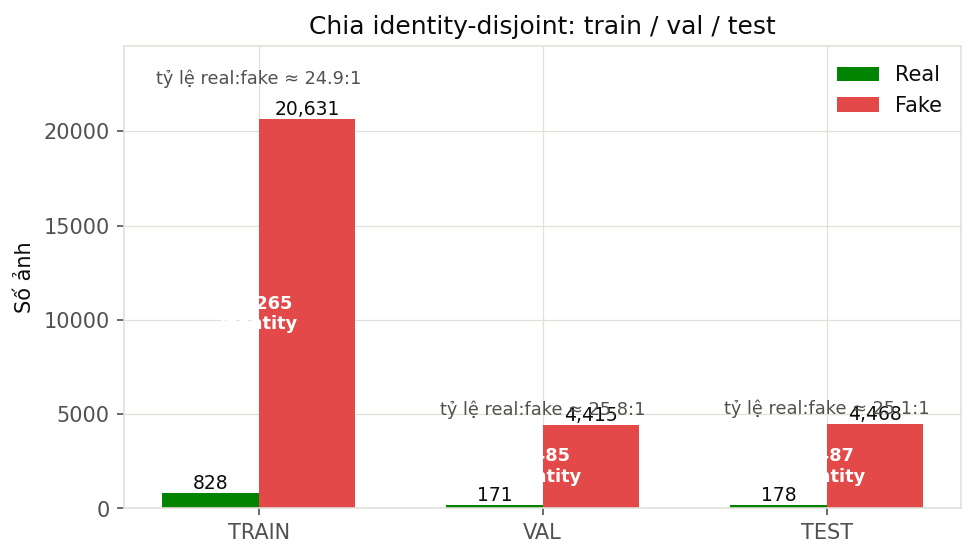

| Split | Tổng | Real | Fake | Identity | Tỷ lệ real:fake |
|---|---|---|---|---|---|
| **train** | 21.459 | 828 | 20.631 | 16.265 | 24,9:1 |
| **val** | 4.586 | 171 | 4.415 | 3.485 | 25,8:1 |
| **test** | 4.646 | 178 | 4.468 | 3.487 | 25,1:1 |
| **test_full_total** | **30.691** | 1.177 | 29.514 | 23.237 | ~25:1 |

- Mỗi split đều đủ **41 nhãn** (40 method fake + real); mọi method có mặt ở cả 3 split
  (per-method test fakes từ 4–426).
- Tỷ lệ real:fake giữ nguyên ~1:25 ở mọi split → **phân phối không đổi**, không lệch tập.

### 5.2 Thống kê lại (1)(2)(3) trên các tập đã chia

- **Real/fake**: như fig01 — train 828/20.631, val 171/4.415, test 178/4.468 (phần 1.3).
- **Nhóm method**: mọi nhóm đều có mặt đủ ở cả 3 split; tỷ trọng nhóm không đổi (Face
  Synthesis > Reenactment > Face Swap > Face Editing).
- **Kích thước/pixel**: ảnh các split cùng nguồn với test_data_v3 → kích thước chủ yếu
  256×256, không có sự khác biệt phân phối giữa các tập.

### 5.3 Kết quả eval trên split identity-disjoint (ViT-S/16+ pretrain, linear probe)

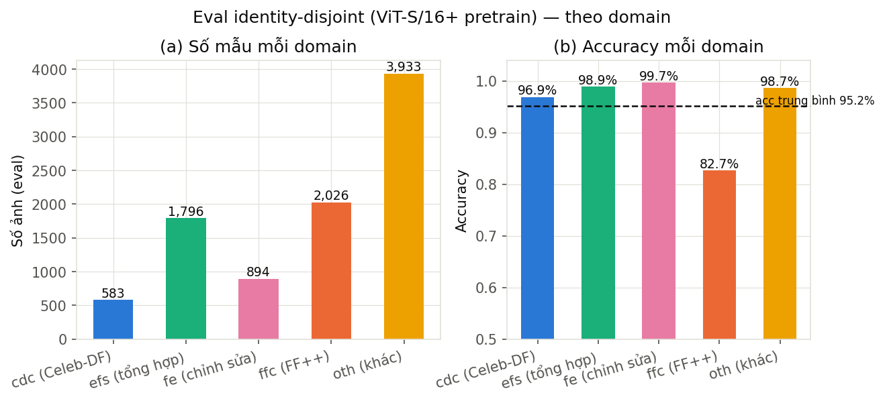

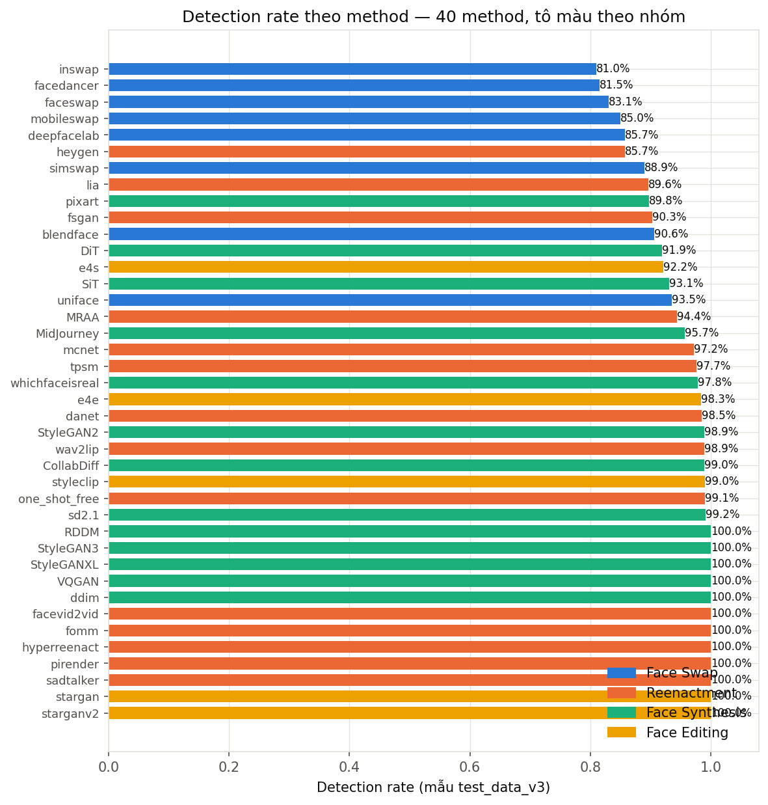

**Tổng quan:** acc **95,19%**, AUC **0,975**, real acc 87,1%, fake detection 95,5%.

**Theo domain:**

| Domain | Số ảnh | Accuracy |
|---|---|---|
| cdc (Celeb-DF) | 583 | 96,9% |
| efs (tổng hợp) | 1.796 | 98,9% |
| fe (chỉnh sửa) | 894 | 99,7% |
| **ffc (FF++)** | **2.026** | **82,7%** ← yếu nhất |
| oth (khác) | 3.933 | 98,7% |

**Nhóm method yếu nhất (detection rate trên domain `ffc` — nguồn FF++):**

| Method | Số ảnh | Detection |
|---|---|---|
| faceswap/ffc | 43 | **23,3%** |
| facedancer/ffc | 43 | **30,2%** |
| inswap/ffc | 38 | **42,1%** |
| DiT/ffc | 39 | 64,1% |
| SiT/ffc | 39 | 71,8% |
| lia/ffc | 43 | 74,4% |

> Mẫu hình rõ: **method video-based trên nguồn FF++ (ffc) bị yếu nhất** — chính là lý do
> các bản finetune sau (exp02 weak-fix, v5 weakfix) tập trung nhóm này. Trên nguồn cdc/oth
> hầu hết method đều ≥ 95%.

---

## 6. Kết luận

1. **Bộ dữ liệu**: DF40 có ~693K frame train; benchmark chuẩn 115.961 ảnh fake; bộ đánh giá
   của đồ án `test_data_v3` = 30.691 ảnh (1.177 real / 29.514 fake, tỷ lệ 1:25).
2. **Nhóm method**: 4 nhóm — Face Swap (8), Reenactment (14), Face Synthesis (13), Face
   Editing (5); Face Synthesis chiếm nhiều ảnh nhất.
3. **EDA**: đa số ảnh 256×256; pixel không phân biệt được thật/giả; artifact khác nhau theo
   method.
4. **Vấn đề**: dữ liệu frames-by-frames trùng identity ~97% → cần split **identity-disjoint**
   để test tổng quát hoá trung thực.
5. **Chia tập**: train 21.459 / val 4.586 / test 4.646, identity-disjoint, tỷ lệ real:fake
   giữ nguyên ~1:25. Eval cho thấy lỗ hổng tập trung ở method video-based nguồn FF++ → là
   mục tiêu finetune.
