# Session 2 — EDA & đánh giá trên bộ train / test finetune mới

> Báo cáo EDA cho **bộ dữ liệu finetune mới** của đồ án anti-deepfake (DINOv3 ViT-S/16 Plus
> so với ConvNeXt): thống kê `data/splits/finetune_plus_train.csv` (123.582 ảnh) và bộ đánh
> giá mới `data/deepfake_test_suite_full_50k/` (50.084 ảnh — test cân bằng 21.446). So với
> bộ DF40 session-1, bộ này **cân bằng real:fake ≈ 1:1** (thay vì 1:25) và **ít trùng
> identity** hơn hẳn (mỗi identity ~2–3.5 ảnh thay vì ~32 frame). Cuối báo cáo gắn kết với
> việc **kiểm chứng thống kê sampler mới A1 có tác dụng thật không** trên chính test này.

## Mục lục

1. [Thống kê train finetune mới — real / fake & nguồn ảnh thật](#1-thống-kê-train-finetune-mới--real--fake--nguồn-ảnh-thật)
2. [42 method fake — gom nhóm & nhóm "yếu" là mục tiêu](#2-42-method-fake--gom-nhóm--nhóm-yếu-là-mục-tiêu)
3. [EDA — kích thước ảnh & grid visual](#3-eda--kích-thước-ảnh--grid-visual)
4. [Cấu trúc identity — bộ mới còn trùng không, và chống leak](#4-cấu-trúc-identity--bộ-mới-còn-trùng-không-và-chống-leak)
5. [Cách chia train / val / test — thống kê theo các tập đã chia](#5-cách-chia-train--val--test--thống-kê-theo-các-tập-đã-chia)
6. [Sampler & "exposure" — vì sao phải đổi sampler](#6-sampler--exposure--vì-sao-phải-đổi-sampler)
7. [Gắn kết: A1 (sampler mới) có tác dụng thật không](#7-gắn-kết-a1-sampler-mới-có-tác-dụng-thật-không)
8. [Kết luận](#8-kết-luận)

---

## 1. Thống kê train finetune mới — real / fake & nguồn ảnh thật

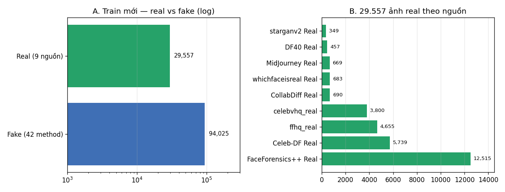

**Tổng 123.582 ảnh** (`finetune_plus_train.csv`):

| | Số ảnh | Tỷ lệ | Nguồn |
|---|---|---|---|
| **Fake** (label 1) | **94.025** | 76,1% | 42 method |
| **Real** (label 0) | **29.557** | 23,9% | 9 nguồn |
| Tỷ lệ | ≈ 3,2 : 1 | | *(session-1 DF40 là ~25:1)* |

**9 nguồn ảnh thật** — một điểm khác hẳn session-1 (chỉ FF++/Celeb-DF):

| Nguồn real | Số ảnh | Loại |
|---|---|---|
| FaceForensics++ Real | 12.515 | frame video FF++ |
| Celeb-DF Real | 5.739 | frame video Celeb-DF |
| ffhq_real (kaggle) | 4.655 | ảnh chụp tĩnh chất lượng cao |
| celebvhq_real | 3.800 | ảnh chụp tĩnh chất lượng cao |
| CollabDiff Real | 690 | ảnh từ diffusion-benchmark |
| whichfaceisreal Real | 683 | ảnh tĩnh |
| MidJourney Real | 669 | ảnh tổng hợp "thật" (AI-synth) |
| DF40 Real | 457 | ảnh real DF40 còn giữ |
| starganv2 Real | 349 | ảnh từ GAN face-editing |

Domain trong CSV train: `real` 24.902 · `fake` 88.997 · `kaggle_synthetic` 4.156
(sfhq_studio) · `kaggle_real` 4.655 (ffhq) · `kaggle_diffusion` 872.

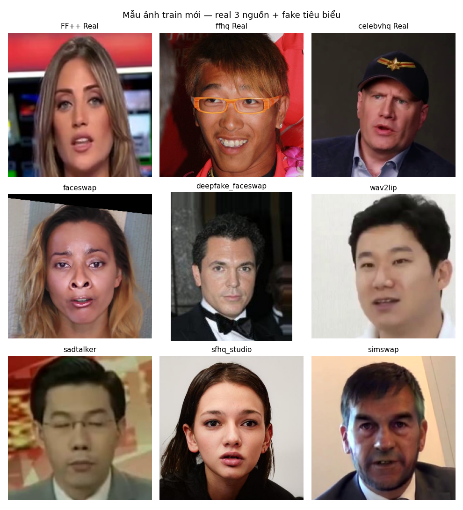

> Trái ngược session-1 (real chỉ từ video frame FF++/Celeb-DF), bộ mới đưa thêm **ảnh tĩnh
> chất lượng cao (ffhq/celebvhq)** và cả ảnh "thật nhưng sinh bởi AI" (MidJourney) → real
> đa dạng hơn, model khó học theo "vẻ video-frame" mà phải học khái niệm thật hơn.

---

## 2. 42 method fake — gom nhóm & nhóm "yếu" là mục tiêu

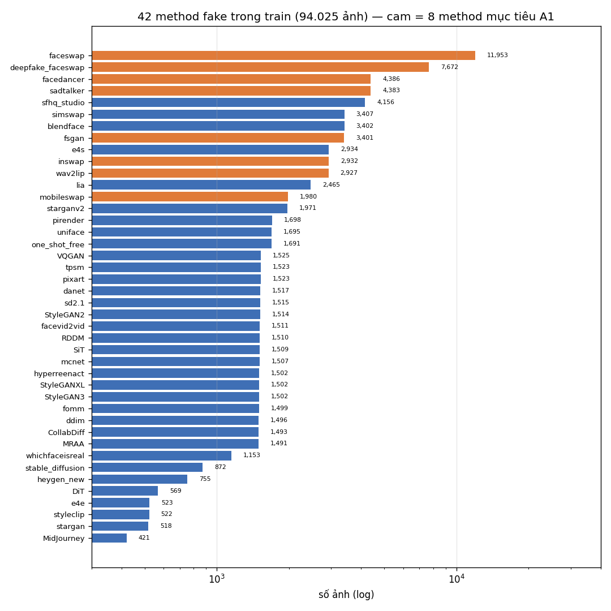

**Phân bố đuôi dài:** tổng fake 94.025 / 42 method. Top theo pool ảnh:

| Method | Pool ảnh | Ghi chú |
|---|---|---|
| **faceswap** | 11.953 | method mạnh — từng là trọng tâm sampler cũ |
| **deepfake_faceswap** | 7.672 | *nhóm yếu* — test det trước đây chỉ ~77% |
| **facedancer** | 4.386 | *nhóm yếu* |
| **sadtalker** | 4.383 | *nhóm yếu* |
| sfhq_studio | 4.156 | diffusion tổng hợp khuôn mặt |
| simswap / blendface | 3.407 / 3.402 | face swap |
| **fsgan / inswap / wav2lip** | 3.401 / 2.932 / 2.927 | *nhóm yếu* |
| lia | 2.465 | reenactment |
| … | … | 34 method còn lại: ~350–5.739, tổng ~71.400 |

**Nhóm "yếu" làm mục tiêu finetune (FAMILY — 8 method):**

`faceswap` · `deepfake_faceswap` · `wav2lip` · `sadtalker` · `fsgan` · `facedancer` · `inswap` · `mobileswap`

Đây là các method mà model base (chỉ finetune theo sampler cũ) **phát hiện kém** trên test
cân bằng — chủ yếu video-face-swap / talking-head. Tổng pool 8 method ≈ **41.000 ảnh fake**.
Hàng còn lại (34 method) giữ nguyên để model không quên fake nói chung.

---

## 3. EDA — kích thước ảnh & grid visual

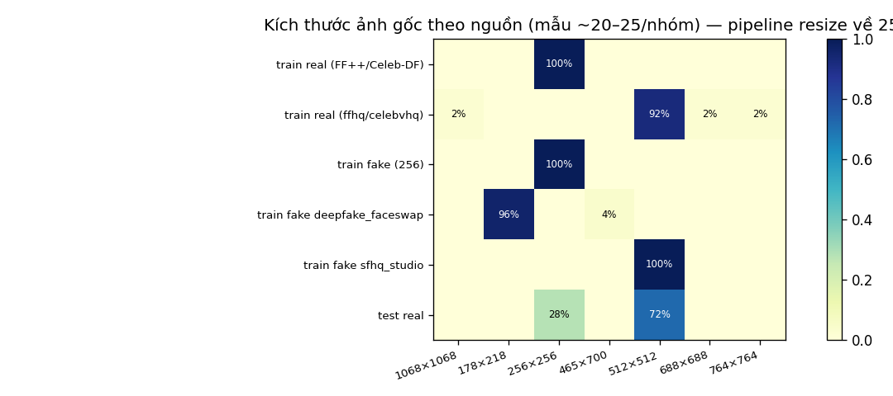

Pipeline finetune luôn **resize về 256×256**, nhưng ảnh *gốc* khác nhau theo nguồn:

| Nhóm | Kích thước gốc chủ yếu | Ghi chú |
|---|---|---|
| real FF++ / Celeb-DF | 256×256 | crop khuôn mặt từ video frame |
| real ffhq / celebvhq | **512×512** | ảnh tĩnh hi-res — khi resize xuống 256 vẫn nét |
| fake thường | 256×256 | đa số method |
| fake **deepfake_faceswap** | **178×218** *(lệch)* | nguồn khác (crop hẹp) — chỉ resize chứ không crop → biến dạng |
| fake **sfhq_studio** | 512×512 | diffusion hi-res |
| test real | hỗn hợp 512/256 | phản ánh đúng real ngoài đời |

> Lưu ý deepfake_faceswap ở 178×218 (không vuông): chính là một phần lý do nó là "method
> khó" — khuôn mặt nguồn vốn đã khác pipeline chuẩn 256.

Grid visual chi tiết hơn ở `fig07_gallery` (mục 1).

---

## 4. Cấu trúc identity — bộ mới còn trùng không, và chống leak

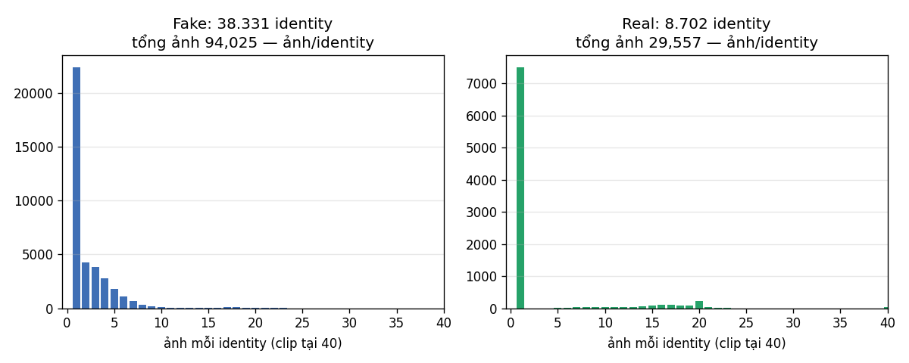

Vấn đề lớn của session-1 là **frames-by-frames trùng ~97%**: mỗi identity ~32 frame
(fig08 session-1). Với bộ train mới:

| | Số ảnh | Identity riêng | Ảnh/identity |
|---|---|---|---|
| Fake (42 method) | 94.025 | **38.331** | **≈ 2,5** |
| Real (9 nguồn) | 29.557 | **8.702** | **≈ 3,4** |

- Hầu hết ảnh fake có identity **gần như độc nhất** (mỗi ảnh 1 id riêng); ~2.5 ảnh/id chủ
  yếu là các cặp video-frame lân cận còn sót trong pipeline làm sạch.
- Real ~3.4 ảnh/identity: mỗi người vài tấm ảnh (ffhq/celebvhq) hoặc vài frame video.
- **Không còn dạng "1 identity nặng ~32 frame"** như DF40 → bộ này gần với bài toán
  phân loại ảnh đơn, trùng lặp thông tin thấp.

**Chống leak (identity-disjoint) đã kiểm chứng lại:**

| Cặp tập | Fake identity chung | Real identity chung |
|---|---|---|
| train ↔ val | **0** | **0** |

Train và val không chia sẻ bất kỳ identity nào (cả fake lẫn real). Bộ test lớn
(`deepfake_test_suite_full_50k`) là suite riêng, được gắn tên *zero_leakage* và dựng độc
lập → model không thể "nhớ identity" để đạt điểm ảo.

---

## 5. Cách chia train / val / test — thống kê theo các tập đã chia

**3 tập độc lập identity:**

| Split | Tổng | Real | Fake | Tỷ lệ real:fake | Ghi chú |
|---|---|---|---|---|---|
| **train** | 123.582 | 29.557 | 94.025 | 1 : 3,2 | dùng để finetune |
| **val** | 6.302 | 1.449 | 4.853 | 1 : 3,3 | chọn checkpoint (EMA) |
| **test (full)** | 50.084 | 25.042 | 25.042 | **1 : 1** | suite mới, zero-leak |
| test (cân bằng) | 21.446 | 10.723 | 10.723 | 1 : 1 | 21.446 ảnh eval chuẩn |

> Điểm khác hẳn session-1: test mới **cân bằng real:fake = 1:1**. Với real chỉ chiếm ~1–4%
> như session-1, một model có thể đạt acc cao mà "thực chất" là tệ phát hiện real; test 1:1
> ép model phải giỏi cả hai phía → số đo trung thực hơn cho mục tiêu chống deepfake.

**Thành phần test cân bằng 21.446** (cùng nguồn với full 50.084):

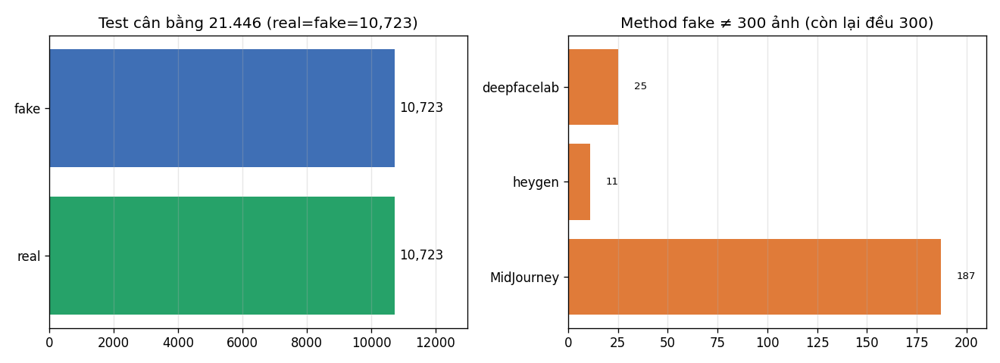

- **Real 10.723:** ff++_real 1.728 · ffhq_real 8.787 · test_data_v3 208 → chủ yếu ảnh tĩnh
  hi-res (nguồn mới không xuất hiện trong train), còn lại frame FF++.
- **Fake 10.723:** 38 method, hầu hết **300 ảnh/method** để per-method det-rate so sánh được;
  ngoại lệ MidJourney 187 · deepfacelab 25 · heygen 11 (nguồn hiếm, lấy hết có sẵn).
- Val 6.302 giữ nguyên tỷ lệ 1:3,3 như train; fake top: faceswap 647 · deepfake_faceswap 404
  · sfhq_studio 219 · sadtalker 217 · facedancer 198 — phản ánh đúng phân phối train.

---

## 6. Sampler & "exposure" — vì sao phải đổi sampler

Sampler mỗi epoch sinh **59.114 ảnh = 2 × số real** (real 29.557). Cách chia slot quyết
định **mỗi ảnh được nhìn bao nhiêu lần/epoch** ("exposure") — với pool nhỏ mà slot lớn thì
ảnh bị lặp lại, pool lớn mà slot nhỏ thì ảnh hầu như không được thấy.

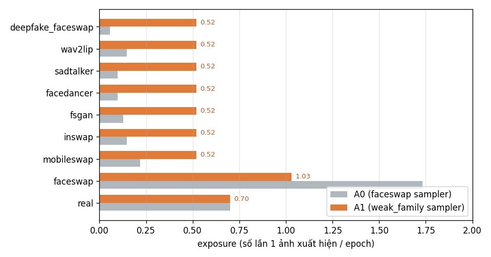

| Method (pool ảnh) | A0 sampler cũ (x/epoch) | A1 weak_family (x/epoch) | Thay đổi |
|---|---|---|---|
| deepfake_faceswap (7.672) | **0,056** | **0,52** | ×9 |
| wav2lip (2.927) | 0,148 | 0,52 | ×3,5 |
| sadtalker (4.383) | 0,099 | 0,52 | ×5,3 |
| facedancer (4.386) | 0,099 | 0,52 | ×5,3 |
| fsgan (3.401) | 0,127 | 0,52 | ×4,1 |
| inswap (2.932) | 0,148 | 0,52 | ×3,5 |
| mobileswap (1.980) | 0,219 | 0,52 | ×2,4 |
| faceswap (11.953) | 1,73 | **1,03** | giảm bớt |
| real (29.557) | 0,70 | 0,70 | giữ nguyên |

- **A0** (faceswap sampler): 30% epoch cho "other" chia **đều theo method** (~433 slot/
  method) → method có pool lớn như deepfake_faceswap (7.672 ảnh) chỉ được 0.056× → **3 epoch
  ≈ model thấy mỗi ảnh chưa đầy 0.2 lần** — gần như vô hình với model.
- **A1** (WeakFamilyBoostedSampler): real 0.35 / **boost 0.45** cho 8 method yếu (theo pool,
  faceswap weight 2.0) / other 0.20 → cả 8 method yếu đạt ~**0.52×**, faceswap hạ còn 1.03×,
  real giữ 0.70× → model "nhìn" group yếu 3–9× nhiều hơn mỗi epoch.

---

## 7. Gắn kết: A1 (sampler mới) có tác dụng thật không

Hai model finetune cùng dữ liệu, chỉ khác sampler, eval trên **cùng 21.446 ảnh test cân
bằng** (fp32 MPS). ConvNeXt (28M, đã finetune trước) là mốc tham chiếu:

| Model | acc% | prec | rec | f1 | AUC | real_acc | FP | FN |
|---|---|---|---|---|---|---|---|---|
| ViT-Plus **A0** (sampler cũ) | 97,91 | 98,05 | 97,77 | 97,91 | 0,9979 | 0,9805 | 209 | 239 |
| ViT-Plus **A1** (weak_family) | **98,47** | 97,94 | **99,02** | **98,48** | **0,9986** | 0,9792 | 223 | 105 |
| ConvNeXt (tham chiếu) | 99,22 | 99,79 | 98,64 | 99,21 | 0,9998 | 0,9979 | 22 | 146 |

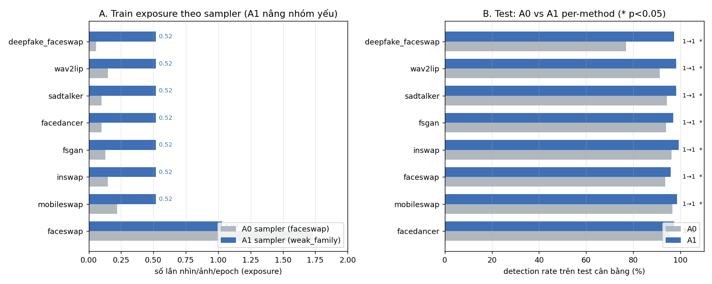

**Kiểm định cặp McNemar** (cùng ảnh, mẫu phụ thuộc):

- **Toàn test:** A0 đúng–A1 sai = 120 · A0 sai–A1 đúng = 240 → **χ² = 39,3 · p = 3,6e-10**
  → cải thiện +0,56 acc là **có ý nghĩa thống kê rất mạnh**, không phải nhiễu.
- **Nhóm FAKE (10.723):** 32 vs 166 → **p = 3e-21** (A1 phát hiện fake tốt hơn hẳn).
- **Nhóm REAL (10.723):** 88 vs 74 → **p = 0,31** → chưa đủ bằng chứng real tụt. Việc
  real_acc val giảm −1,4 (do phân phối real-frame FF++ trong val) **không lan sang test**
  → không phải overfit cục bộ.
- **Per-method** (fake, 300/method): có nghĩa (p<0,05): deepfake_faceswap **+61 ảnh**
  (p=1,6e-14) · wav2lip +21 · sadtalker +13 · fsgan +9 · inswap +9 · faceswap +7 ·
  mobileswap +6. Không method nào tụt đáng kể. Mẫu hình cải thiện **trùng khớp đúng 8
  method được tăng exposure** → hiệu quả thật, đúng mục tiêu.

**Kết luận kiểm chứng:** A1 là một bước hợp lệ — nâng 8 method yếu đúng chỗ, giảm 134 FN,
real giữ nguyên trên test cân bằng, không overfit cục bộ. Vẫn còn gap với ConvNeXt
(98,47 vs 99,22), tập trung ở **real** (FP 223 vs 22) → bước kế tiếp (A2) dùng **KD từ
ConvNeXt** để học lại khả năng phân biệt real, cô lập biến so với A1.

---

### 7.1 Backbone **pretrained đông cứng** (linear probe) — feature đã "hiểu" deepfake chưa?

Hai backbone đúng phiên bản *chưa finetune* (nguồn weight như lúc khởi tạo A0/A1 và
ConvNeXt finetune), không có head → gán head bằng **linear probe**: đông cứng backbone,
extract feature toàn bộ **train 123.582**, L2-normalize từng ảnh, fit
`LogisticRegression(class_weight='balanced')`, eval đúng **cùng test cân bằng 21.446**.
Tham số gần nhau (ViT-S/16+ 28,7M / ConvNeXt 27,8M) → so sánh công bằng:

| Model | acc% | prec | rec | f1 | AUC | real_acc | FP | FN |
|---|---|---|---|---|---|---|---|---|
| **Pretr_Plus_v3** (ViT probe, đông cứng) | 89,47 | 88,86 | 90,25 | 89,55 | 0,9624 | 88,69 | 1213 | 1046 |
| **Pretr_ConvNeXt_v3** (ConvNeXt probe, đông cứng) | 87,77 | 89,62 | 85,44 | 87,48 | 0,9553 | 90,11 | 1061 | 1561 |
| ViT-Plus **A0** (sampler cũ) | 97,91 | 98,05 | 97,77 | 97,91 | 0,9979 | 0,9805 | 209 | 239 |
| ViT-Plus **A1** (weak_family) | 98,47 | 97,94 | 99,02 | 98,48 | 0,9986 | 0,9792 | 223 | 105 |
| ConvNeXt (tham chiếu) | 99,22 | 99,79 | 98,64 | 99,21 | 0,9998 | 0,9979 | 22 | 146 |

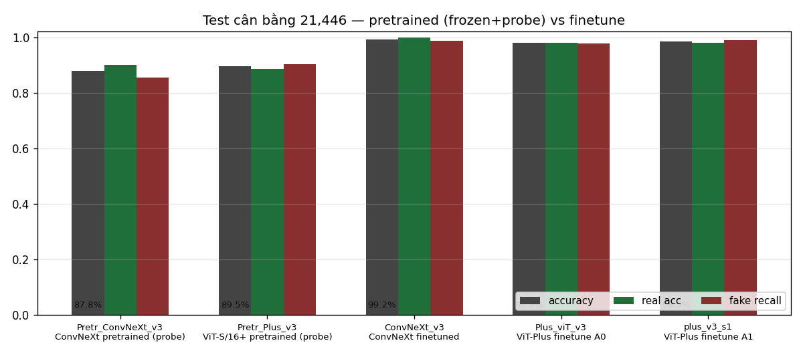

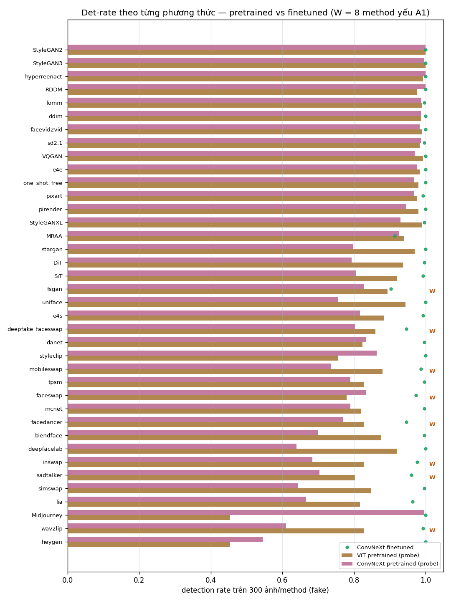

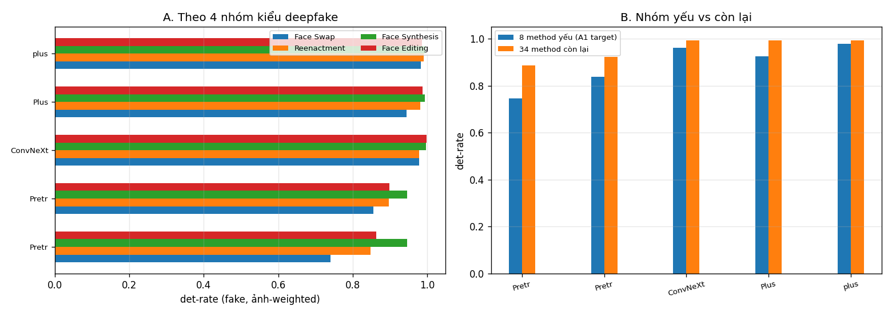

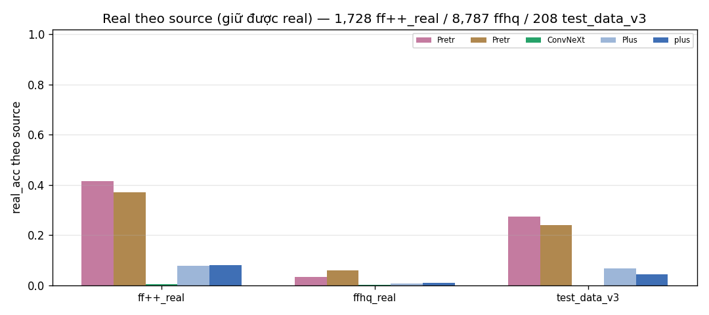

**Đọc kết quả — vai trò của finetune:**

- **Feature pretrained đã phân biệt được đáng kể** (AUC ≈ 0,96 cho cả hai) nhưng kém xa
  finetune: gap acc khoảng **9–11 điểm** (89,5 → 98,5 với ViT; 87,8 → 99,2 với ConvNeXt).
  Toàn bộ lợi ích của finetune nằm ở việc **tinh chỉnh feature riêng cho bài**, không phải
  chỉ gắn head.
- **Điểm yếu trùng đúng mục tiêu A1:** hai probe yếu nhất ở **Face Swap** (ConvNeXt probe
  chỉ 74,0%; ViT probe 85,6%) và cụm **8 method yếu** (74,6% / 83,7%) — đúng nhóm mà
  sampler A1 nhắm tới → dữ liệu thật cho thấy nhóm này khó với chính feature học sẵn.
  Method tệ nhất từng probe: **heygen** (11 ảnh, n nhỏ) và **MidJourney** (ViT 45,5%),
  **wav2lip / simswap / deepfacelab** (ConvNeXt ≈ 61–64%).
- **Hướng thiên vị khác nhau:** ViT probe giữ fake tốt hơn (rec 90,3 vs 85,4) nhưng thả
  real nhiều hơn (real_acc 88,7 vs 90,1); ConvNeXt probe ngược lại — giữ real tốt, sót fake
  nhiều. Với ConvNeXt, probe train acc (0,8138) cao hơn ViT (0,8067) mà test lại thấp hơn
  → feature ConvNeXt ít khái quát sang miền deepfake hơn khi chưa finetune.
- **Face Synthesis gần như "free":** cả hai probe đã đạt ≈ 95% mà không cần finetune → các
  method tổng hợp khuôn mặt (StyleGAN, diffusion...) lệch phân phối rõ so với ảnh thật.
  Ngược lại **Face Editing chỉ 86–90%** khi probe nhưng lên ≈ 99% khi finetune → các biến
  đổi nhẹ về style cần feature được tinh chỉnh mới bắt được.
- **Real theo nguồn** (fig12): cả hai probe thả ~11–13% real **ff++_real** (frame-video
  nén mạnh) nhiều hơn ffhq — đúng nguồn khó đã biết; finetune khép gap này gần như triệt để.

**Kết luận mở rộng:** so sánh cùng phép đo (cùng test, cùng thủ tục) chứng minh phần tăng
điểm của A0/A1/ConvNeXt-fin là từ **finetune feature**, không phải artifact của việc chọn
test — và định vị đúng chỗ finetune còn thiếu (8 method yếu ở A1, real ở ViT) là mục tiêu
chính đáng cho A2 (KD từ ConvNeXt).

## 8. Kết luận

1. **Bộ dữ liệu mới khác hẳn DF40 session-1:** cân bằng hơn (train 1:3,2; test **1:1**),
   real đa dạng 9 nguồn (thêm ảnh tĩnh hi-res ffhq/celebvhq), 42 method fake với phân phối
   đuôi dài.
2. **Ít trùng identity hơn hẳn:** ~2,5–3,4 ảnh/identity (session-1 ~32 frame/identity) →
   bộ gần bài toán ảnh đơn; **train ↔ val overlap identity = 0** (fake + real), test là
   suite riêng zero-leakage → số đo eval trung thực.
3. **Kích thước:** pipeline đồng nhất về 256×256; nguồn hi-res 512×512; riêng
   deepfake_faceswap lệch 178×218 — một phần lý do nó khó.
4. **Nhóm yếu cần bù = 8 method FAMILY** (~41.000 ảnh): video-face-swap/talking-head mà
   sampler cũ "bỏ đói" (exposure 0,056×).
5. **Đổi sampler A1 tăng exposure nhóm yếu 3–9×, hiệu quả đã kiểm chứng thống kê** trên
   test cân bằng mới: +0,56 acc, −134 FN, McNemar p=3,6e-10, không method nào tụt, không
   overfit. Bước kế tiếp là A2 (KD từ ConvNeXt) nhắm gap real.
